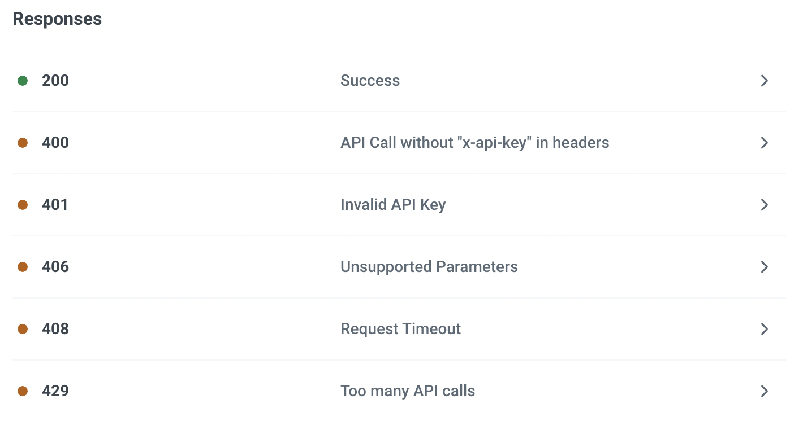
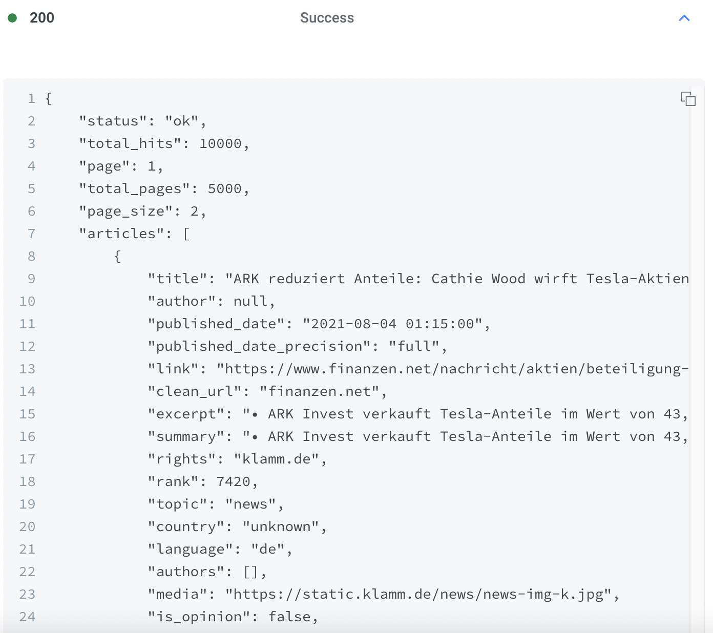

# API 란

## API(Application Programming Interface)

 
 **응용 프로그램에서 사용할 수 있도록, 운영 체제나 프로그래밍 언어가 제공하는 기능을 제어할 수 있게 만든 인터페이스**로, 주로 파일 제어, 창 제어, 화상 처리, 문자 제어 등을 위한 인터페이스를 제공한다. 
 컴퓨터나 컴퓨터 프로그램 사이의 연결이자, **Server(Back-end)와 Client(Front-end) 사이의 대화**라고 이해할 수 있다. 
 일종의 소프트웨어 인터페이스이며 다른 종류의 소프트웨어에 서비스를 제공한다.  

# EX) News API

1달 무료 News API 사이트 : [Newscatcher](https://docs.newscatcherapi.com/api-docs/endpoints/search-news)

위 사이트 <code>GET</code> 부분 url주소로 서버에 api 요청 가능. 
https://api.newscatcherapi.com
/v2/search?q=Tesla&page_size=2 

|단어|의미|
|--|--|
|v2|version2|
|search|endpoint(정확히 어떤 것을 달라!)|
|?|Query(API마다 rule이 있음)|

-> 해당 Query 내용 : Tesla에 관련된 뉴스를 보여달라, page_size = 2(2개 페이지를 받는다)

-> API제공자에게 API를 요청하는 개인의 고유값을 보냄. 
제공자는 해당 개인을 판별하고, 관리할 수 있음.(계정정지, charge 등..)

-> 상태별로 에러 핸들링

-> API를 요청 성공했을 때, 받는 정보들.(Objects 객체들)