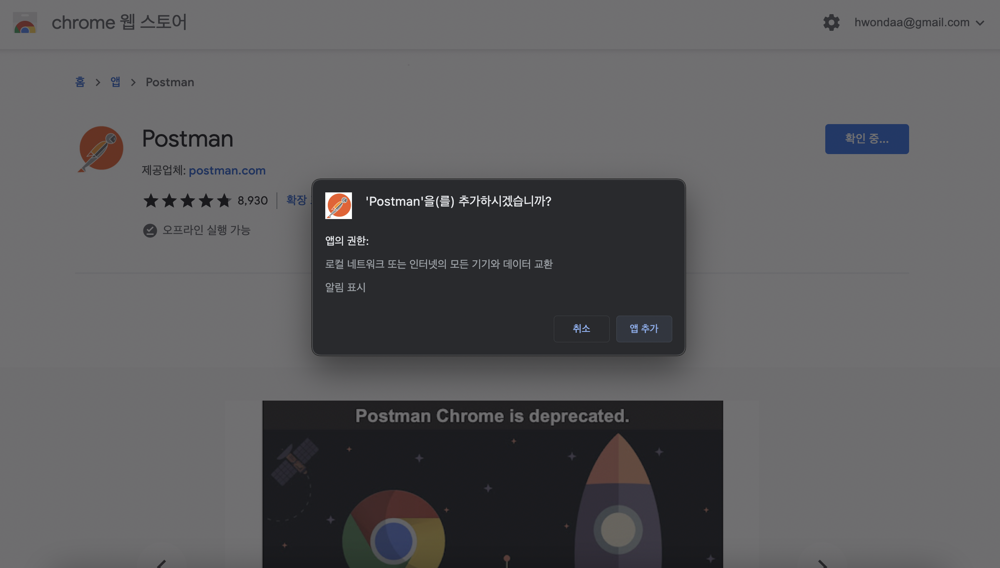
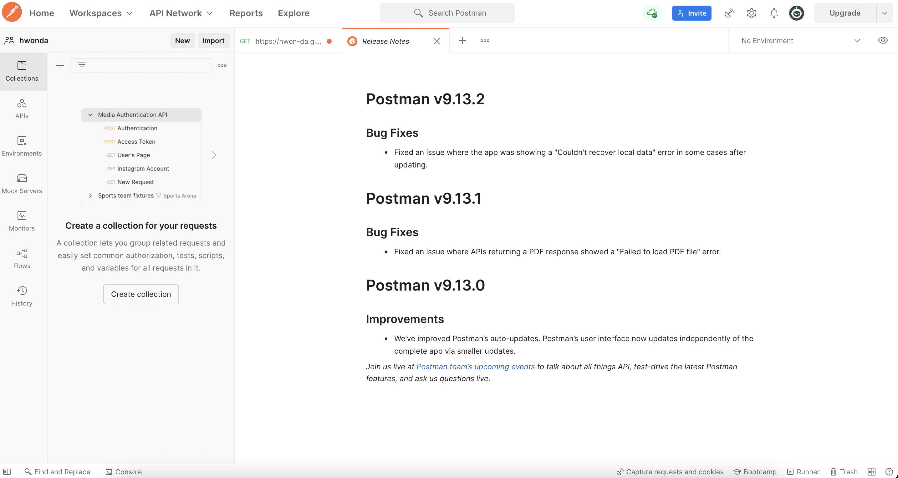
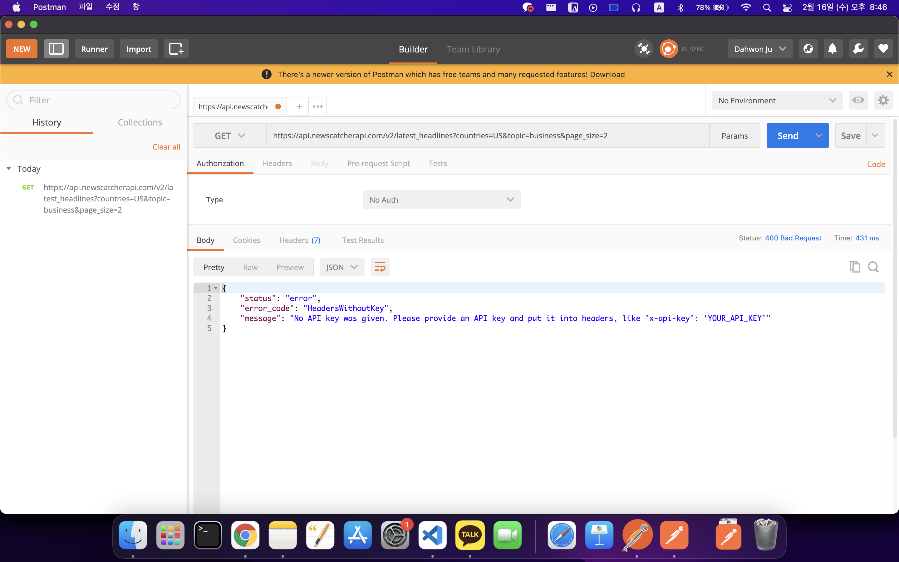
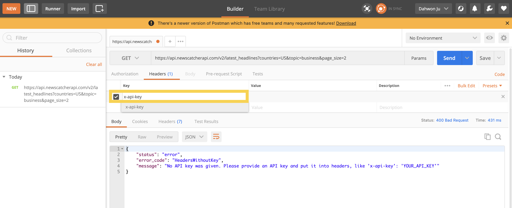
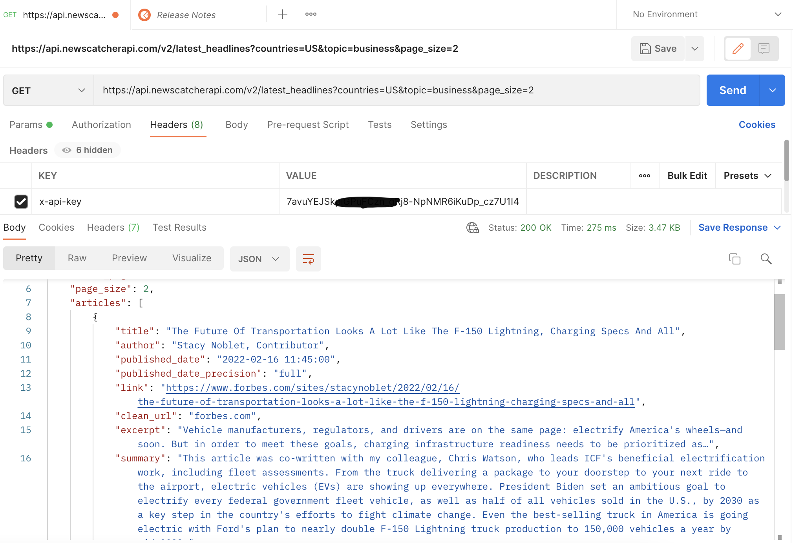

# API 불러오기

## Postman (Tool)

백앤드의 각 라우트가 잘 동작하는지 테스트 할 때 쓰기 좋은 tool을 하나 소개한다.
1. 로그인 라우트에 요청을 보내기
2. 응답받은 token을 복사하기
3. token이 필요한 다른 라우트에 인증값으로 붙여넣기

위 과정을 모두 해결한다. 
**한번 세팅으로 자동으로 token을 postman 내부 변수에 담아** 편하게 이용할 수 있다.  

 : chrome 웹 스토어에서 다운받아, 브라우저에 앱 추가가 가능하다.

 : 메인 화면

 : GET에 API 주소를 입력하면 위와 같이 뜬다. (key 값을 설정하기 전) 

 이 때, API key값을 미리 header에 넣으면 API를 가져올 수 있다. 
 
  : Value 값에 해당 페이지에서 나온 key를 해당 페이지에서 원하는 형식으로 넣으면 된다.(ex. x-api-key)

  
   : 짜잔! Postman으로 API 불러오기 성공.

   ### 이제 Javascript로 API를 가져오기만 남았다.